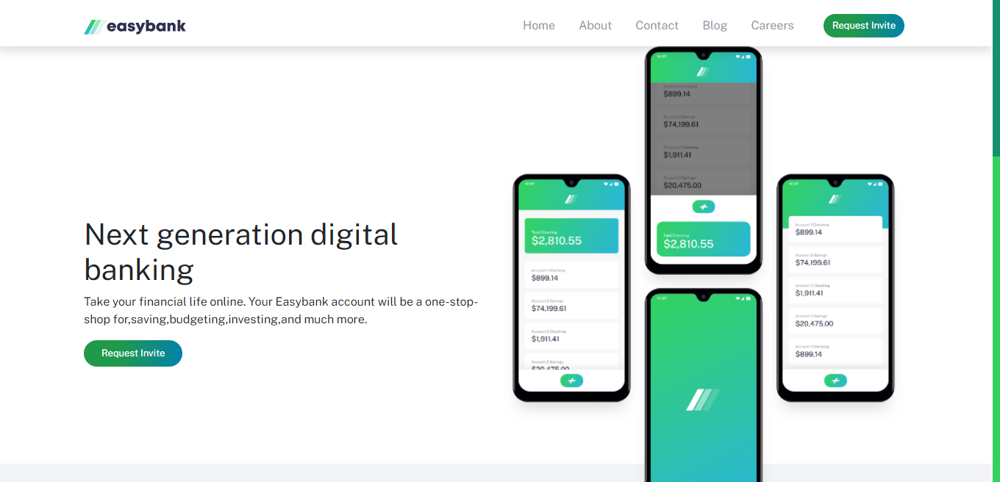

# Frontend Mentor Easybank landing page Challenge
This is a solution to the [Easybank landing page challenge on Frontend Mentor](https://www.frontendmentor.io/solutions/easybank-landing-page-Syr-qnZXq). Frontend Mentor challenges help you improve your coding skills by building realistic projects.

### The challenge

Users should be able to: 

- View the optimal layout for the site depending on their device's screen size  
- See hover states for all interactive elements on the page 
- See what services we provide   
- Contact Us easly  

# Built with
-HTML  
-Sass  
-Bootstrap 5
